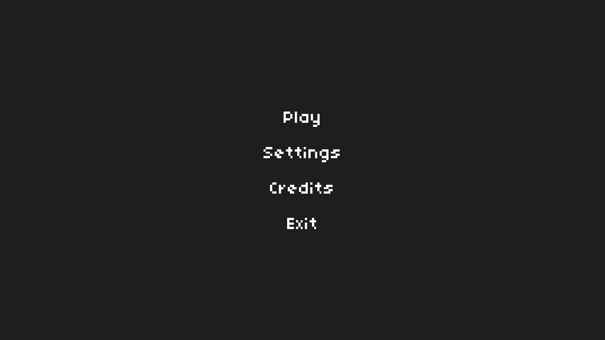
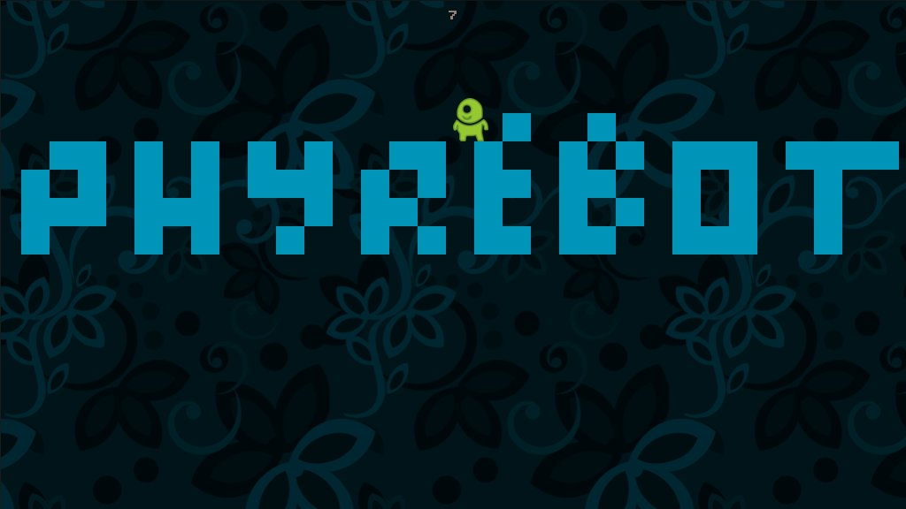
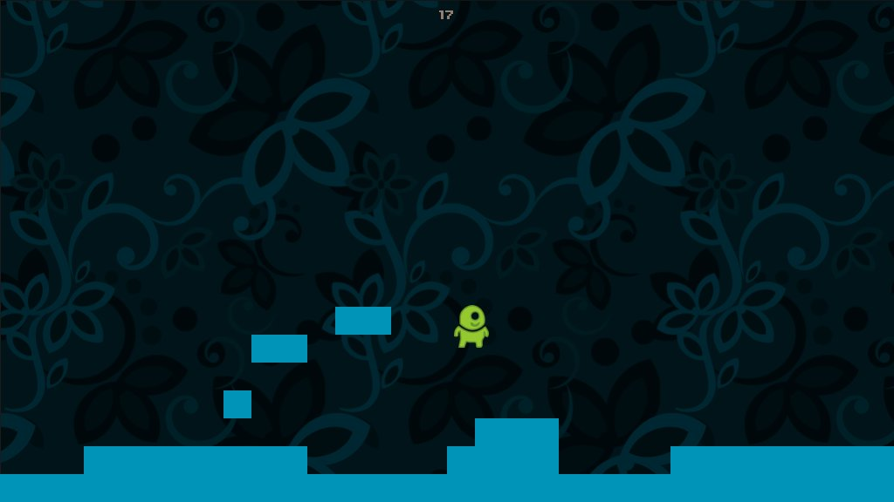

## About
Python and Pygame base code for making 2D platformer games.

## Development
Python 2.7 and Pygame.
Pytmx for levels.

## Screenshots 
  

## License
Licensed under the [MIT License](License.txt)

## Website
www.phyrebotcentral.com
